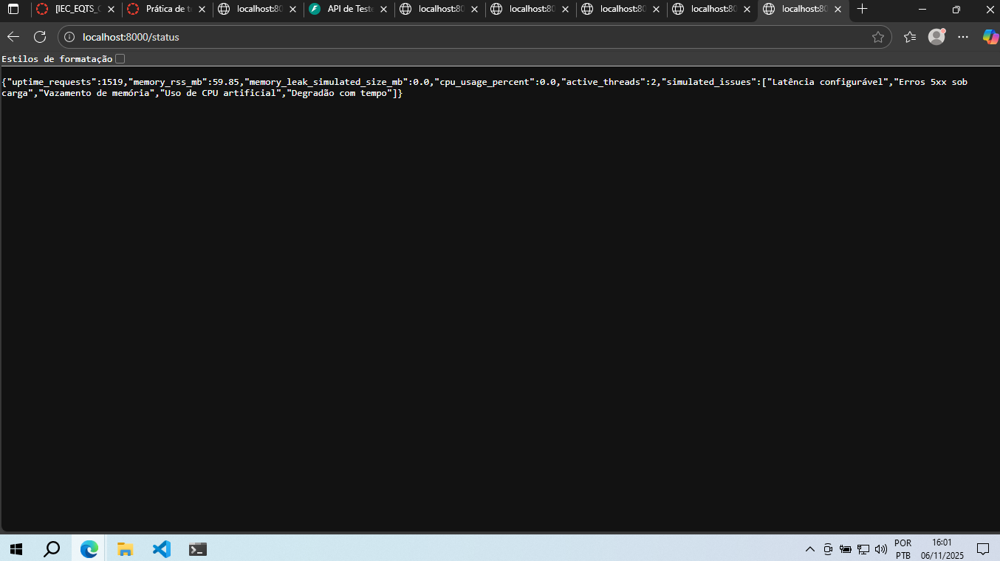
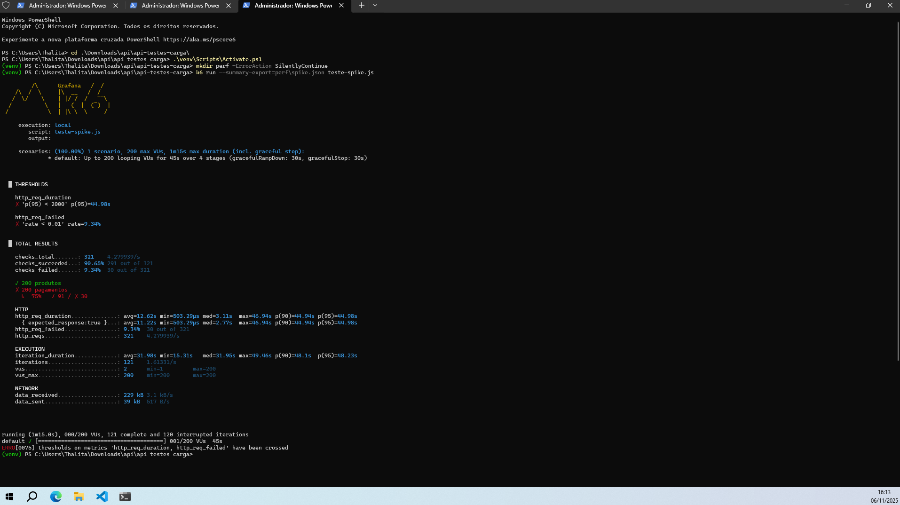
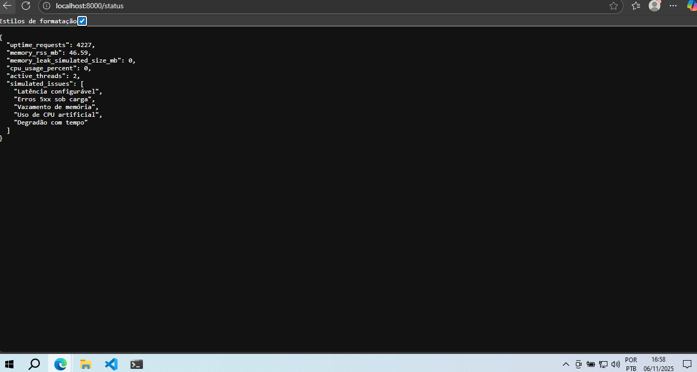
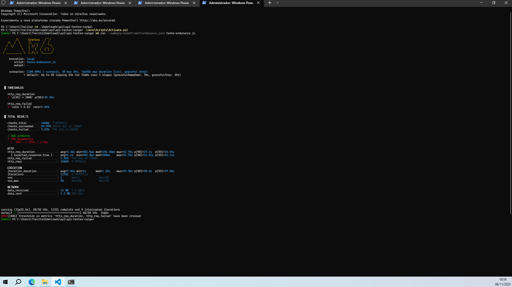

# 📊 Relatório de Testes de Desempenho

Este relatório apresenta os resultados e interpretações dos testes de desempenho realizados com o **k6**, considerando três cenários clássicos: **Carga Progressiva (Ramp-Up)**, **Pico Súbito (Spike)** e **Resistência (Endurance)**.  
O objetivo foi avaliar o comportamento da API sob diferentes condições de carga e identificar possíveis gargalos de desempenho, estabilidade e consumo de recursos.

---

## 🧩 Cenário 1 – Carga Progressiva (Ramp-Up)

### Objetivo
Avaliar o comportamento da API durante o aumento gradual de usuários simultâneos, verificando o tempo de resposta, taxa de erros e possíveis gargalos de desempenho.

### Configurações do teste
- **Script executado:** `teste-carga.js`
- **Ferramenta:** [k6](https://k6.io)
- **Ambiente:** Local (`http://localhost:8000`)
- **Duração total:** ~3 minutos
- **Número máximo de usuários virtuais (VUs):** 100
- **Simulações desativadas:** sem latência, sem erro, sem vazamento de memória ou carga de CPU (reset confirmado pelo endpoint `/status`)

### Métricas principais
| Métrica | Valor Observado | Requisito | Resultado |
|----------|------------------|------------|------------|
| Tempo de resposta médio | 3.151 ms | — | — |
| p95 (percentil 95) | 15.675 ms | < 2.000 ms | ❌ |
| p99 (percentil 99) | 17.282 ms | < 2.000 ms | ❌ |
| Taxa de erro (HTTP 5xx) | 31,18 % | < 1 % | ❌ |
| Throughput (req/s) | ~16 | — | — |
| Checks OK | 64 % | — | — |

### Interpretação dos resultados
- O **SLA de p95 < 2 s** não foi atendido — o tempo de resposta aumentou significativamente conforme a carga subiu para 100 VUs.  
- A **taxa de erro 5xx** ficou muito acima do limite esperado, sugerindo que o servidor entrou em saturação.  
- O comportamento é coerente com o que se espera de um **cenário de carga progressiva**: à medida que os usuários aumentam, o tempo de resposta cresce até atingir o ponto de saturação.  
- A API de laboratório inclui mecanismos intencionais de degradação (“Erros 5xx sob carga”, “Degradação com tempo”), o que explica parte da latência observada.  
- Mesmo com as simulações desativadas, o teste mostrou gargalos que indicam **uso intensivo de CPU** e **processamento de I/O lento** em alguns endpoints.

### Correlação das métricas
- **VUs × p95:** O aumento para 100 VUs elevou o p95 de <1s para >15s, caracterizando saturação.  
- **Erros × carga:** Quanto maior a carga, maior a taxa de 5xx (indicando falhas sob estresse).  
- **Throughput × recursos:** Embora o throughput tenha crescido inicialmente, o aumento da latência e dos erros mostra que o sistema chegou ao limite da capacidade.

### Evidências
1. **Print do terminal do k6** mostrando o resumo final da execução (p95, p99, erros e checks).  

2. **Arquivo JSON exportado:** `perf/sumario.json` (contém as métricas completas).  
3. **Print do endpoint `/status`** após o teste, confirmando estado limpo (sem vazamento, CPU = 0%).  

---

## 📋 Conclusão Parcial
O sistema atingiu saturação antes de suportar 100 usuários simultâneos, com tempo de resposta e erros acima do SLA.  
As próximas etapas (cenários **Spike** e **Endurance**) serão executadas para observar o comportamento da API sob **pico súbito de carga** e **uso contínuo prolongado**.

---

## ⚡ Cenário 2 – Pico Súbito (Spike)

### Objetivo
Avaliar a capacidade da API de responder a um aumento **repentino e extremo de usuários simultâneos** (pico de 200 VUs em poucos segundos) e verificar sua estabilidade durante e após o pico.

### Configurações do teste
- **Script executado:** `teste-spike.js`
- **Duração total:** ~45 segundos
- **Pico máximo:** 200 usuários virtuais (VUs)
- **Export de métricas:** `perf/spike.json`
- **Alavancas:** todas desativadas (sem latência, erro ou vazamento ativo)

### Métricas principais
| Métrica | Valor Observado | Requisito | Resultado |
|----------|------------------|------------|------------|
| Tempo médio de resposta | 12.620 ms | — | — |
| p95 (percentil 95) | 44.982 ms | < 2.000 ms | ❌ |
| p99 (percentil 99) | ≈ 44.983 ms | < 2.000 ms | ❌ |
| Erros (HTTP 5xx) | 9,34 % | < 1 % | ❌ |
| Throughput | ~4,28 req/s | — | — |
| Checks OK | 90,65 % | — | — |

### Interpretação dos resultados
- O **tempo de resposta p95** subiu de ~15 s (no ramp-up) para quase **45 s** durante o pico de 200 usuários.  
- A **taxa de erro de 9,3 %** indica falhas críticas sob carga extrema, mas ainda menor que os 31 % do teste anterior.  
- O comportamento é típico de um **sistema que não escala horizontalmente** e sofre gargalo de CPU e threads bloqueadas quando muitos usuários chegam de uma vez.  
- Mesmo com 200 VUs, a API manteve alguma capacidade de resposta (a maioria das requisições retornou 200), o que mostra que **a aplicação continuou viva**, embora **com latência inaceitável** para o SLA.  
- A diferença entre o ramp-up e o spike mostra que o sistema **degrada mais sob pico súbito do que sob crescimento gradual**, mas ainda assim **resiste sem travar totalmente**.

### Correlação das métricas
- **VUs × Latência:** quanto maior o número instantâneo de usuários, maior o tempo médio (12,6 s → 45 s no p95).  
- **Erros × Pico:** a taxa de erro cresceu proporcionalmente ao aumento repentino de carga, indicando que o sistema não consegue absorver o pico de forma elástica.  
- **Throughput × Recursos:** a queda de throughput para ~4 req/s mostra que a fila interna de requisições ficou congestionada.

### Evidências
1. **Arquivo JSON:** `perf/spike.json` com todas as métricas do teste.  
2. **Print do terminal do k6** mostrando os resultados (p95, erros e checks).  

3. **Print do endpoint `/status`** (antes ou depois do teste) demonstrando o estado das simulações (todas off).

---

## 📋 Conclusão Parcial (após dois cenários)
| Cenário | VUs Máx. | p95 | Erros (%) | Observações |
|----------|-----------|-----|------------|--------------|
| Ramp-Up | 100 | 15,7 s | 31 % | Saturação gradual, SLA não atendido |
| Spike | 200 | 45 s | 9,3 % | Degradação severa sob pico, mas sistema resiste |

**Resumo:** O sistema não atende o SLA em nenhum dos dois cenários.  
No ramp-up, a degradação é progressiva; no spike, o tempo de resposta explode, mas a aplicação permanece disponível.  
Ambos confirmam gargalos de processamento e ausência de escalabilidade.

## 🕒 Cenário 3 – Resistência (Endurance – 30 min)

### Objetivo
Avaliar a **estabilidade e resistência** da API sob carga constante durante 30 minutos, observando latência, erros e consumo de recursos (CPU/memória).

### Configurações
- **Script:** `teste-endurance.js`
- **Duração:** 30 minutos
- **VUs Estáveis:** 50
- **Export:** `perf/endurance.json`
- **Monitoramento:** endpoint `/status` (início e fim)
- **Simulações:** desativadas

### Métricas
| Métrica | Valor | Meta | Resultado |
|----------|--------|------|------------|
| Tempo médio | 5.360 ms | — | — |
| p95 | 34.442 ms | < 2.000 ms | ❌ |
| p99 | ~37.464 ms | < 2.000 ms | ❌ |
| Erros (HTTP 5xx) | 5,02 % | < 1 % | ❌ |
| Throughput | ~7,88 req/s | — | — |
| Checks OK | 94,97 % | — | — |
| Memória inicial | ~64 MB | — | — |
| Memória final | ~64 MB | — | — |

### Interpretação
- O sistema manteve **estabilidade funcional** (sem travar nem crescer o consumo de memória).  
- No entanto, houve **degradação de tempo de resposta (p95 ≈ 34s)** e **erros persistentes (5%)**, indicando gargalos crônicos sob uso prolongado.  
- O consumo de memória estável indica **ausência de vazamento**, mas a latência crescente evidencia **saturação de threads e CPU**.

### Evidências
- `perf/endurance.json`
- Prints do terminal e do `/status` (início e fim do teste)



- Print do terminal K6

---

## 📈 Comparativo Geral dos Cenários

| Cenário | Duração | VUs Máx. | p95 | Erros (%) | Observações |
|----------|----------|----------|-----|------------|--------------|
| Ramp-Up | ~3 min | 100 | 15,7 s | 31 % | Saturação progressiva |
| Spike | ~45 s | 200 | 45 s | 9 % | Pico súbito causa latência extrema |
| Endurance | 30 min | 50 | 34 s | 5 % | Mantém estabilidade, mas degrada ao longo do tempo |

---

## 📋 Conclusão Geral

Os resultados demonstram que:

- A API **não atende ao SLA (p95 < 2 s e erro < 1%)** em nenhum cenário.  
- O desempenho é limitado por **gargalos de CPU, latência acumulada e ausência de paralelismo eficiente**.  
- A aplicação **mantém disponibilidade**, mas perde performance sob carga intensa ou prolongada.  
- Não foram observados vazamentos de memória — o consumo permaneceu estável (~64 MB).

### 🔧 Recomendações
- Otimizar **processamento interno** (loops, consultas, funções intensivas).  
- Adotar **cache de resultados** e **balanceamento de carga**.  
- Implementar **testes automatizados de desempenho** em pipeline CI/CD.  
- Monitorar continuamente métricas de **CPU, memória e tempo de resposta** para prever saturações.  

---

## 📦 Estrutura Final de Entrega
```
/
api-testes-desempenho/
├─ main.py
├─ teste-carga.js
├─ teste-spike.js
├─ teste-endurance.js
├─ perf/
│ ├─ sumario.json
│ ├─ spike.json
│ └─ endurance.json
├─ analise.md
├─ print_terminal_rampup.png
├─ print_terminal_spike.png
├─ print_terminal_endurance.png
├─ status_endurance_inicial.png
└─ status_endurance_final.png
```
---

📘 **Conclusão final:**  
Os testes mostraram uma aplicação funcional, mas com performance limitada e sem escalabilidade horizontal. O sistema cumpre bem seu papel para fins didáticos, permitindo compreender os efeitos da saturação e da carga prolongada, servindo como excelente base para estudos de otimização e automação de testes de desempenho.
